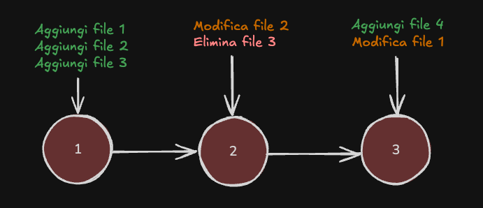

# Guida Git e Github

Questa guida costituisce una reference per i reparti all'interno di Apex che utilizzano Git e Github.

### Indice

- [Guida Git e Github](#guida-git-e-github)
    - [Indice](#indice)
  - [Introduzione](#introduzione)
  - [Git](#git)
    - [Come funziona](#come-funziona)
    - [Creare una repository](#creare-una-repository)
    - [Fare cambiamenti](#fare-cambiamenti)
    - [Eseguire un commit](#eseguire-un-commit)
    - [Ispezionare la cronologia](#ispezionare-la-cronologia)

## Introduzione

**Git** è un sistema di controllo versione distribuito open source che tiene traccia delle modifiche apportate ai file nel tempo. Consente di tornare a versioni specifiche, confrontare le modifiche, collaborare con altri e altro ancora. Permette quindi di mantenere una cronologia dei cambiamenti ai file di cui si tiene traccia e offre le basi per la collaborazione con altre persone.

**Github**, d'altra parte, è un servizio di hosting repository basato sul web che utilizza Git. Fornisce una piattaforma basata sul cloud per la collaborazione e la gestione di progetti di controllo della versione Git. Github semplifica la collaborazione con altri su progetti, consente di tenere traccia delle modifiche e funge da backup remoto per il codice.

Quindi, lo strumento con cui si lavora è semplicemente Git, mentre Github permette di hostare i file e di condividere i progressi con il resto del team.

## Git

Git si può usare da terminale o anche attraverso uno strumento come Github Desktop.

### Come funziona

Git mantiene una cronologia completa e versionata di tutte le modifiche al progetto attraverso una struttura di dati con **commit** collegati. Invece di memorizzare versioni complete dei file ad ogni salvataggio, Git acquisisce "snapshot" incrementali. Ogni commit rappresenta lo stato del progetto in un momento specifico e contiene un riferimento al commit precedente, stabilendo una cronologia collegata e ordinata. Si può pensare a un commit come un pallino di una serie che contiene solo ciò che differisce dal pallino precedente.

Git permette di organizzare questi commit in più rami separati, in modo da permettere la coesistenza allo stesso tempo di cronologie diverse senza conflitti. Di base c'è un solo ramo, che è anche quello principale, il `main`. Il `main` deve contenere solamente la versione stabile dei file, ogni sperimentazione o nuova feature andrebbe sviluppata su un altro ramo o branch. A questo ci arriveremo dopo.

### Creare una repository

### Fare cambiamenti

Ogni volta che si effettuano delle modifiche ai file, questi cambiamenti vengono riconosciuti da Git, 

### Eseguire un commit

### Ispezionare la cronologia
