# Guida Git e Github

Questa guida costituisce una reference per i reparti all'interno di Apex che utilizzano Git e Github.

### Indice

- [Guida Git e Github](#guida-git-e-github)
    - [Indice](#indice)
  - [Introduzione](#introduzione)
- [Git](#git)
  - [Come funziona](#come-funziona)
  - [Creare una repository](#creare-una-repository)
  - [Lavorare con Git](#lavorare-con-git)
    - [Aggiungere file](#aggiungere-file)
    - [Eseguire un commit](#eseguire-un-commit)
    - [Fare cambiamenti](#fare-cambiamenti)
    - [Eliminare files](#eliminare-files)
    - [Ripristinare files](#ripristinare-files)
    - [Ispezionare la cronologia](#ispezionare-la-cronologia)

## Introduzione

**Git** è un sistema di controllo versione distribuito open source che tiene traccia delle modifiche apportate ai file nel tempo. Consente di tornare a versioni specifiche, confrontare le modifiche, collaborare con altri e altro ancora. Permette quindi di mantenere una cronologia dei cambiamenti ai file di cui si tiene traccia e offre le basi per la collaborazione con altre persone.

**Github**, d'altra parte, è un servizio di hosting repository basato sul web che utilizza Git. Fornisce una piattaforma basata sul cloud per la collaborazione e la gestione di progetti di controllo della versione Git. Github semplifica la collaborazione con altri su progetti, consente di tenere traccia delle modifiche e funge da backup remoto per il codice.

Quindi, lo strumento con cui si lavora è semplicemente Git, mentre Github permette di hostare i file e di condividere i progressi con il resto del team.

# Git

Git si può usare da terminale o anche attraverso uno strumento come Github Desktop.

## Come funziona

Git mantiene una cronologia completa e versionata di tutte le modifiche al progetto attraverso una struttura di dati con **commit** collegati. Invece di memorizzare versioni complete dei file ad ogni salvataggio, Git acquisisce "snapshot" incrementali. Ogni commit rappresenta lo stato del progetto in un momento specifico e contiene un riferimento al commit precedente, stabilendo una cronologia collegata e ordinata. Si può pensare a un commit come un pallino di una serie che contiene solo ciò che differisce dal pallino precedente.


Git permette di organizzare questi commit in più rami separati, in modo da permettere la coesistenza allo stesso tempo di cronologie diverse senza conflitti. Di base c'è un solo ramo, che è anche quello principale, il `main`. Il `main` deve contenere solamente la versione stabile dei file, ogni sperimentazione o nuova feature andrebbe sviluppata su un altro ramo o branch. A questo ci arriveremo dopo.

## Creare una repository

Una repository non è nient'altro che una cartella in cui viene inizializzato Git, ovvero in cui viene creata la cartella `.git`, che contiene tutti i file che servono a Git per tenere traccia delle modifiche e per accedere alla cronologia.

Per creare una nuova repository da terminale basta creare una nuova cartella, entrare all'interno di essa ed eseguire il comando `git init`. Su Linux/MacOS:

```bash
mkdir tutorial # crea la cartella
cd tutorial    # entra nella cartella
git init
```

L'output sul terminale dovrebbe essere una cosa del genere:

```text
Initialized empty Git repository in ${PERCORSO_ASSOLUTO_CARTELLA}/.git/
```

Con Github Desktop basta andare sulla barra degli strumenti e fare **File > Nuova repository**.


Comparirà una schermata del tipo:

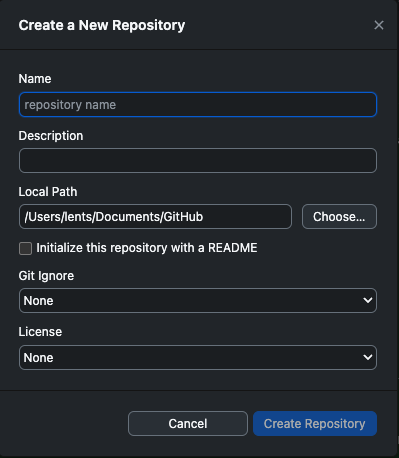

in cui vanno inseriti il nome della repo che si vuole creare, la descrizione (opzionale) e il percorso in cui creare la cartella in locale. Le altre opzioni le vedremo in seguito.

## Lavorare con Git

### Aggiungere file

Una volta che creiamo un file nella cartella della repo, questo viene rilevato per la prima volta da Git, giustamente, ed esso stesso ci consiglierà di aggiungerlo ai file da committare.

Ad esempio creiamo un file chiamato `foo.txt`, scrivendo all'interno di questo file "Hello World". Git ovviamente non sta ancora tracciando i cambiamenti che avvengono in questo file, e questo lo possiamo verificare eseguendo il comando `git status`, che nel nostro caso darebbe il seguente output (sempre se eseguito all'interno della repo):

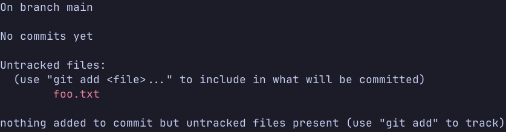

Notiamo varie cose:

- Git ci dice che ci troviamo sul `main` branch.
- Non abbiamo ancora fatto commit, la cronologia è vuota.
- Git ha riconosciuto un file di cui non tiene ancora traccia, proprio `foo.txt`
- Git ci consiglia di eseguire il comando `git add` per far sì che cominci a tenere traccia del nuovo file.

L'equivalente su Github Desktop sarebbe semplicemente la sezione **Changes** sulla sinistra.

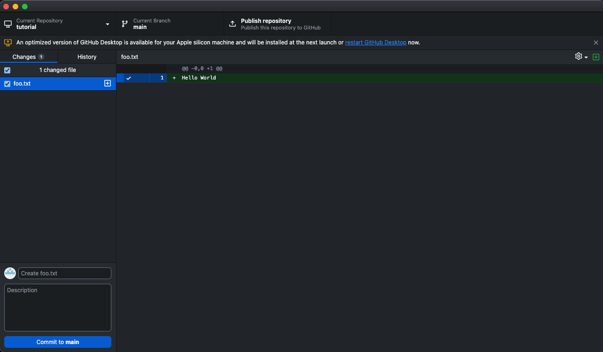

Vediamo infatti che il file `foo.txt` si trova tra i "cambiamenti" all'interno della repo e sulla destra vediamo il nuovo contenuto evidenziato in verde.

Per quanto riguarda `git add`, in verità utilizzeremo questo comando non solo per aggiungere nuovi file alla cosiddetta _staging area_, ovvero a quell'insieme di file di cui vogliamo committare le modifiche, ma anche per aggiungere a quest'ultima file modificati ed eliminati, come vedremo dopo.

Aggiungiamo quindi questo file alla _staging area_ con `git add`, a cui dobbiamo specificare il percorso relativo del file da dove ci troviamo nel terminale. Se ci troviamo nel percorso base della repo:

```bash
git add foo.txt
```

(L'"equivalente" su Github Desktop sarebbe, più o meno, semplicemente selezionare con la spunta il file, come nell'immagine di sopra. In verità non esegue direttamente `git add` sul file, ma lo esegue prima di committare.)

Una volta eseguito questo comando vediamo l'output di `git status`.

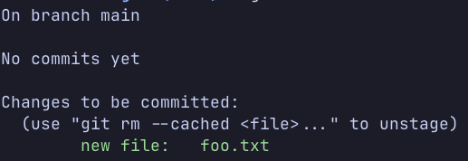

Vediamo che adesso il file si trova tra i _changes to be committed_, pronto quindi per essere committato. Più avanti vedremo anche come rimuoverlo dalla _staging area_, in caso non si volesse darlo a Git per tenerne traccia.

### Eseguire un commit

Adesso però è il momento di fare il nostro primo commit e quindi di aggiungere il primo pallino all'interno della nostra cronologia. Il comando da terminale è ovviamente `git commit`, il quale prenderà tutti i nuovi file, quelli eliminati e quelli modificati all'interno della _staging area_, ovvero quelli su cui si è eseguito `git add` oppure quelli spuntati su Github Desktop (cosa che funziona solo se si committa da Github Desktop), e crea un nuovo nodo nella cronologia.

Questo comando necessita obbligatoriamente di un messaggio che identifichi il commit. Idealmente questo commit deve riassumere i cambiamenti che questo commit apporta, deve essere esplicativo ma anche sintetico. Possono esistere due o più commit con lo stesso messaggio tuttavia. Per esempio:

```bash
git commit -m "Primo commit"
```

La flag `-m` ci permette di specificare il messaggio del commit tra virgolette. Inoltre, se si volessero aggiungere spiegazioni aggiuntive (consigliato), si può anche inserire una descrizione del commit, aggiungendo un altro messaggio con `-m`:

```bash
git commit -m "Primo commit" -m "Aggiunto 'foo.txt'"
# Non si possono usare le doppie virgolette all'interno di altre doppie virgolette!!!
```

Da Github Desktop, l'equivalente sarebbe compilare i relativi campi e cliccare su **Commit** (ricordando di selezionare i file da committare):

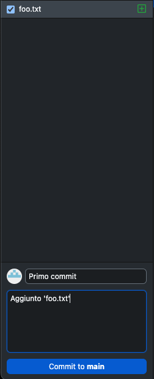

Dopo il commit si può notare, sia tramite `git status` che tramite l'interfaccia di Github Desktop, che non sono più presenti cambiamenti da dare in pasto a Git.

### Fare cambiamenti

Ogni volta che si effettuano delle modifiche ai file, queste vengono riconosciute da Git, che aggiunge questi cambiamenti tra quelli che si possono aggiungere alla _staging area_. Proviamo a modificare il file `foo.txt` modificando la riga già presente e aggiungendone un'altra. Questo è quello che alla fine sarà all'interno di `foo.txt`

```text
Apex1
Apex2
```

Adesso che il file è stato modificato, vediamo l'output di `git status` dal terminale (sempre trovandoci nella cartella della repo):

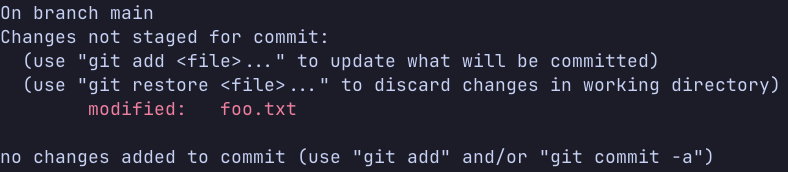

Su Github Desktop vediamo invece questo:

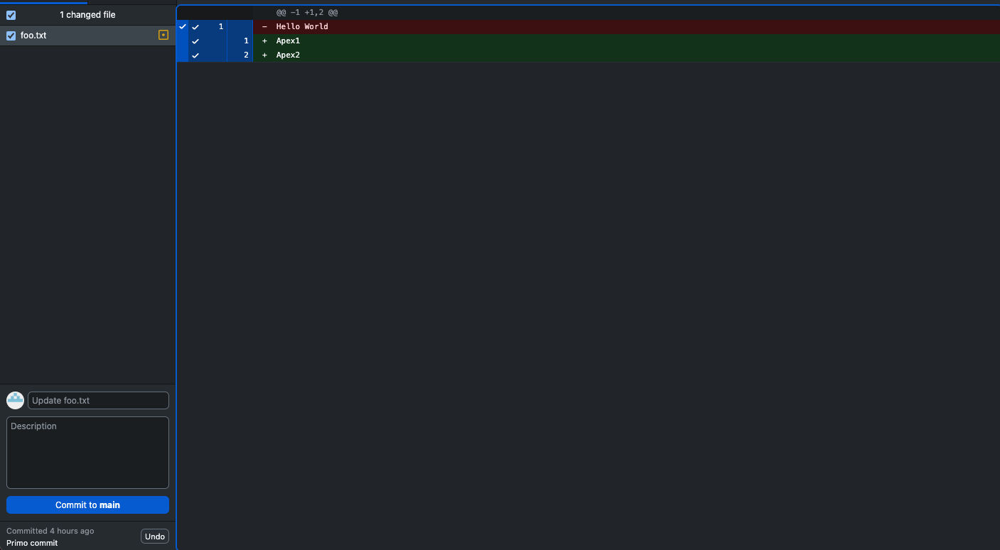

a destra notiamo anche i cambiamenti che Git ha rilevato. Notiamo che, secondo Git, è stata eliminata la riga che conteneva "Hello World" per aggiungere poi le altre due.

Ritornando all'output di `git status`, ci dice, giustamente, che il file `foo.txt` è stato modificato. Ci dice anche che si può tornare al file originale tramite il comando `git restore`. Infatti, se eseguissimo il comando:

```bash
git restore foo.txt
```

L'output di `git status` diventa:

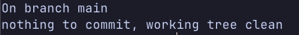

e andando a vedere il contenuto di `foo.txt`:

```text
Hello World!
```

mentre su Github Desktop non vediamo nessuna entry nei cambiamenti.

Come nel caso di aggiunzione dei file, anche le modifiche ai file si aggiungono alla _staging area_ tramite `git add` per poi eseguire il `git commit`, oppure semplicemente tramite Github Desktop selezionando i file da voler committare e poi eseguendo il commit.

> ⭐ **Curiosità**
>
> Da notare anche che, su Github Desktop, nella sezione dei cambiamenti un file aggiunto ha un'icona verde, mentre un file modificato ha un'icona gialla. Vedremo che un file eliminato ha un'icona rossa.

### Eliminare files

Git rileva anche le eliminazioni di file: dal commit in poi, il file non sarà più all'interno della cronologia.

> ❗ **Attenzione**
>
> Anche se dopo il commit non vedremo più il file nella nostra cartella, questo non vuol dire che sia stato cancellato completamente dalla cronologia: tornando a un commit precedente da quello in cui il file è stato eliminato, troveremo il file in questione!

Proviamo quindi ad eliminare il file `foo.txt`. L'output di `git status` è:

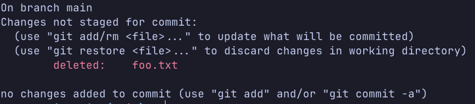

mentre su Github Desktop vediamo questo:

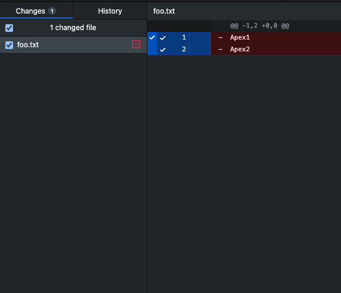

Se eseguissimo il commit, il file non sarà più presente da qui in avanti.

### Ripristinare files

Git ci da pure l'opportunità di riprstinare i file che abbiamo modificato o eliminato, in modo da tornare sui nostri passi prima di fare un commit.

Ad esempio, l'ultima cosa che abbiamo fatto è stato eliminare il file `foo.txt`. Se volessimo recuperarlo dovremmo, usualmente, andare nel cestino del nostro computer e recuperare manualmente il file. Tuttavia, Git ci offre un comando apposito: `git restore`. Eseguendo il comando:

```bash
git restore foo.txt
```

Vedremo, tramite `git status`, che Git non rileva più cambiamenti nella nostra cartella, e che il file `foo.txt` è tornato al suo posto.

Su Github Desktop basterebbe cliccare col tasto destro sul file che vogliamo ripristinare e selezionare la voce **Discard Changes**.

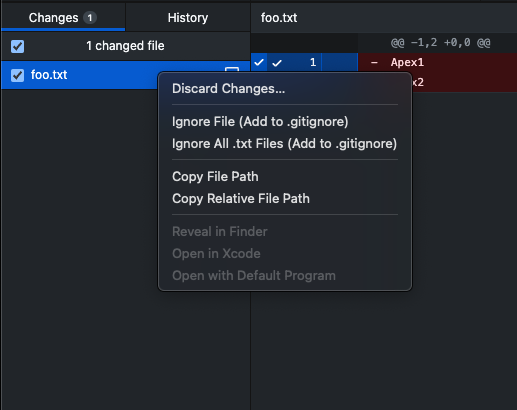

La stessa cosa funziona se proviamo a modificare il file `foo.txt`: infatti, premettendo di riavere il file nella cartella, non eliminato, aggiungiamo la riga:

```text
Apex3
```

Vediamo, sia tramite `git status` che tramite l'interfaccia di Github Desktop, che Git ha rilevato un cambiamento al file. Tramite `git restore`, o la voce **Discard Changes** di Github Desktop, possiamo ripristinare il file a com'era prima della modifica.

Se invece avessimo aggiunto un file modificato o eliminato alla *staging area* (cosa possibile solamente tramite il terminale e il comando `git add`, su Github Desktop non si esegue questo comando manualmente), per ripristinare i cambiamenti non basterebbe usare `git restore`, ma una sua variante.

Infatti, una volta aggiunto questo file alla *staging area*, vediamo che l'output di `git status` è il seguente:

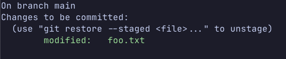

Ci dice che per togliere il file dalla *staging area* ("*unstage*") dobbiamo eseguire il comando `git restore --staged` più il percorso del file. Quindi eseguendo:

```bash
git restore --staged foo.txt
```

l'output di `git status` sarà:

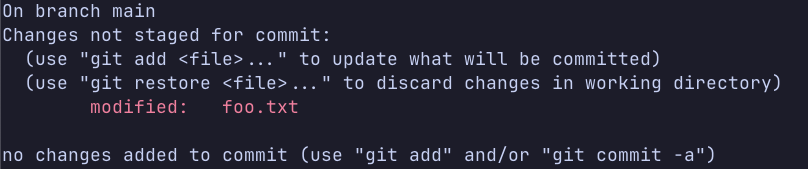

Quindi ha semplicemente tolto `foo.txt` dalla *staging area*.

### Ispezionare la cronologia
