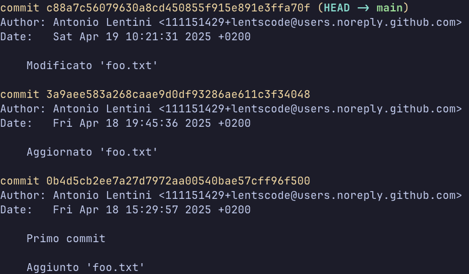
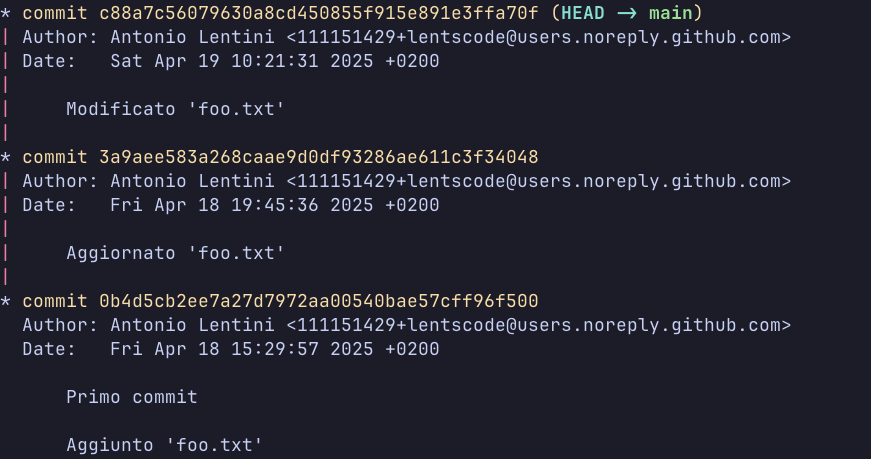
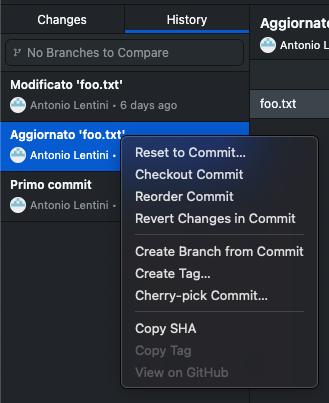
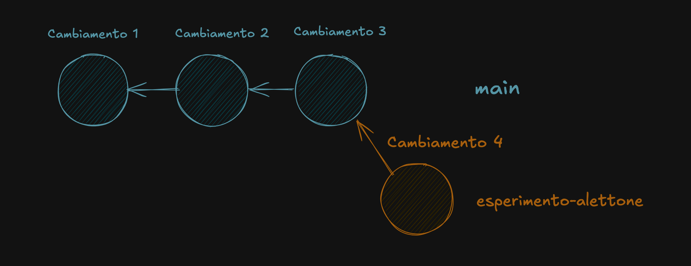
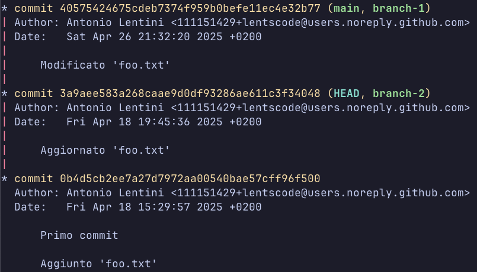
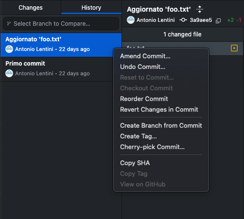

# Guida Git e Github

Questa guida costituisce una reference per i reparti all'interno di Apex che utilizzano Git e Github.

### Indice

- [Guida Git e Github](#guida-git-e-github)
    - [Indice](#indice)
  - [Introduzione](#introduzione)
- [Git](#git)
  - [Come funziona](#come-funziona)
  - [Creare una repository](#creare-una-repository)
  - [Aggiungere, modificare, eliminare](#aggiungere-modificare-eliminare)
    - [Aggiungere file](#aggiungere-file)
    - [Eseguire un commit](#eseguire-un-commit)
    - [Fare cambiamenti](#fare-cambiamenti)
    - [Eliminare files](#eliminare-files)
    - [Ripristinare files](#ripristinare-files)
  - [Sfruttare la cronologia](#sfruttare-la-cronologia)
    - [Ispezionare la cronologia](#ispezionare-la-cronologia)
    - [Navigare nella cronologia](#navigare-nella-cronologia)
    - [Ritornare a un commit (e cancellare quelli successivi)](#ritornare-a-un-commit-e-cancellare-quelli-successivi)
  - [Lavorare con i *branch*](#lavorare-con-i-branch)
    - [Come funzionano i branch](#come-funzionano-i-branch)
    - [Creare un branch](#creare-un-branch)
    - [Eseguire commit su un branch](#eseguire-commit-su-un-branch)
    - [Passare da un branch all'altro](#passare-da-un-branch-allaltro)
    - [Rinominare un branch](#rinominare-un-branch)
    - [Eliminare un branch](#eliminare-un-branch)
    - [Unire due branch](#unire-due-branch)
      - [`git branch`](#git-branch)
      - [`git rebase`](#git-rebase)
      - [Scegliere tra un `merge` e un `rebase`](#scegliere-tra-un-merge-e-un-rebase)
  - [Github](#github)
    - [Collegare una repo](#collegare-una-repo)
    - [Clonare una repo](#clonare-una-repo)
    - [Operazioni in remoto](#operazioni-in-remoto)
      - [`git push`](#git-push)
      - [`git fetch`](#git-fetch)
      - [`git pull`](#git-pull)
    - [Mantenere l'ordine](#mantenere-lordine)
      - [Divisione in più branch](#divisione-in-più-branch)
      - [Pull Requests](#pull-requests)
## Introduzione

**Git** è un sistema di controllo versione distribuito open source che tiene traccia delle modifiche apportate ai file nel tempo. Consente di tornare a versioni specifiche, confrontare le modifiche, collaborare con altri e altro ancora. Permette quindi di mantenere una cronologia dei cambiamenti ai file di cui si tiene traccia e offre le basi per la collaborazione con altre persone.

**Github**, d'altra parte, è un servizio di hosting repository basato sul web che utilizza Git. Fornisce una piattaforma basata sul cloud per la collaborazione e la gestione di progetti di controllo della versione Git. Github semplifica la collaborazione con altri su progetti, consente di tenere traccia delle modifiche e funge da backup remoto per il codice.

Quindi, lo strumento con cui si lavora è semplicemente Git, mentre Github permette di hostare i file e di condividere i progressi con il resto del team.

# Git

Git si può usare da terminale o anche attraverso uno strumento come Github Desktop.

## Come funziona

Git mantiene una cronologia completa e versionata di tutte le modifiche al progetto attraverso una struttura di dati con **commit** collegati. Invece di memorizzare versioni complete dei file ad ogni salvataggio, Git acquisisce "snapshot" incrementali. Ogni commit rappresenta lo stato del progetto in un momento specifico e contiene un riferimento al commit precedente, stabilendo una cronologia collegata e ordinata. Si può pensare a un commit come un pallino di una serie che contiene solo ciò che differisce dal pallino precedente.


Git permette di organizzare questi commit in più rami separati, in modo da permettere la coesistenza allo stesso tempo di cronologie diverse senza conflitti. Di base c'è un solo ramo, che è anche quello principale, il `main`. Il `main` deve contenere solamente la versione stabile dei file, ogni sperimentazione o nuova feature andrebbe sviluppata su un altro ramo o branch. A questo ci arriveremo dopo.

## Creare una repository

Una repository non è nient'altro che una cartella in cui viene inizializzato Git, ovvero in cui viene creata la cartella `.git`, che contiene tutti i file che servono a Git per tenere traccia delle modifiche e per accedere alla cronologia.

Per creare una nuova repository da terminale basta creare una nuova cartella, entrare all'interno di essa ed eseguire il comando `git init`. Su Linux/MacOS:

```bash
mkdir tutorial # crea la cartella
cd tutorial    # entra nella cartella
git init
```

L'output sul terminale dovrebbe essere una cosa del genere:

```text
Initialized empty Git repository in ${PERCORSO_ASSOLUTO_CARTELLA}/.git/
```

Con Github Desktop basta andare sulla barra degli strumenti e fare **File > Nuova repository**.


Comparirà una schermata del tipo:


in cui vanno inseriti il nome della repo che si vuole creare, la descrizione (opzionale) e il percorso in cui creare la cartella in locale. Le altre opzioni le vedremo in seguito.

## Aggiungere, modificare, eliminare

### Aggiungere file

Una volta che creiamo un file nella cartella della repo, questo viene rilevato per la prima volta da Git, giustamente, ed esso stesso ci consiglierà di aggiungerlo ai file da committare.

Ad esempio creiamo un file chiamato `foo.txt`, scrivendo all'interno di questo file "Hello World". Git ovviamente non sta ancora tracciando i cambiamenti che avvengono in questo file, e questo lo possiamo verificare eseguendo il comando `git status`, che nel nostro caso darebbe il seguente output (sempre se eseguito all'interno della repo):


Notiamo varie cose:

- Git ci dice che ci troviamo sul `main` branch.
- Non abbiamo ancora fatto commit, la cronologia è vuota.
- Git ha riconosciuto un file di cui non tiene ancora traccia, proprio `foo.txt`
- Git ci consiglia di eseguire il comando `git add` per far sì che cominci a tenere traccia del nuovo file.

L'equivalente su Github Desktop sarebbe semplicemente la sezione **Changes** sulla sinistra.


Vediamo infatti che il file `foo.txt` si trova tra i "cambiamenti" all'interno della repo e sulla destra vediamo il nuovo contenuto evidenziato in verde.

Per quanto riguarda `git add`, in verità utilizzeremo questo comando non solo per aggiungere nuovi file alla cosiddetta _staging area_, ovvero a quell'insieme di file di cui vogliamo committare le modifiche, ma anche per aggiungere a quest'ultima file modificati ed eliminati, come vedremo dopo.

Aggiungiamo quindi questo file alla _staging area_ con `git add`, a cui dobbiamo specificare il percorso relativo del file da dove ci troviamo nel terminale. Se ci troviamo nel percorso base della repo:

```bash
git add foo.txt
```

(L'"equivalente" su Github Desktop sarebbe, più o meno, semplicemente selezionare con la spunta il file, come nell'immagine di sopra. In verità non esegue direttamente `git add` sul file, ma lo esegue prima di committare.)

Una volta eseguito questo comando vediamo l'output di `git status`.


Vediamo che adesso il file si trova tra i _changes to be committed_, pronto quindi per essere committato. Più avanti vedremo anche come rimuoverlo dalla _staging area_, in caso non si volesse darlo a Git per tenerne traccia.

### Eseguire un commit

Adesso però è il momento di fare il nostro primo commit e quindi di aggiungere il primo pallino all'interno della nostra cronologia. Il comando da terminale è ovviamente `git commit`, il quale prenderà tutti i nuovi file, quelli eliminati e quelli modificati all'interno della _staging area_, ovvero quelli su cui si è eseguito `git add` oppure quelli spuntati su Github Desktop (cosa che funziona solo se si committa da Github Desktop), e crea un nuovo nodo nella cronologia.

Questo comando necessita obbligatoriamente di un messaggio che identifichi il commit. Idealmente questo commit deve riassumere i cambiamenti che questo commit apporta, deve essere esplicativo ma anche sintetico. Possono esistere due o più commit con lo stesso messaggio tuttavia. Per esempio:

```bash
git commit -m "Primo commit"
```

La flag `-m` ci permette di specificare il messaggio del commit tra virgolette. Inoltre, se si volessero aggiungere spiegazioni aggiuntive (consigliato), si può anche inserire una descrizione del commit, aggiungendo un altro messaggio con `-m`:

```bash
git commit -m "Primo commit" -m "Aggiunto 'foo.txt'"
# Non si possono usare le doppie virgolette all'interno di altre doppie virgolette!!!
```

Da Github Desktop, l'equivalente sarebbe compilare i relativi campi e cliccare su **Commit** (ricordando di selezionare i file da committare):


Dopo il commit si può notare, sia tramite `git status` che tramite l'interfaccia di Github Desktop, che non sono più presenti cambiamenti da dare in pasto a Git.

### Fare cambiamenti

Ogni volta che si effettuano delle modifiche ai file, queste vengono riconosciute da Git, che aggiunge questi cambiamenti tra quelli che si possono aggiungere alla _staging area_. Proviamo a modificare il file `foo.txt` modificando la riga già presente e aggiungendone un'altra. Questo è quello che alla fine sarà all'interno di `foo.txt`

```text
Apex1
Apex2
```

Adesso che il file è stato modificato, vediamo l'output di `git status` dal terminale (sempre trovandoci nella cartella della repo):


Su Github Desktop vediamo invece questo:


a destra notiamo anche i cambiamenti che Git ha rilevato. Notiamo che, secondo Git, è stata eliminata la riga che conteneva "Hello World" per aggiungere poi le altre due.

Ritornando all'output di `git status`, ci dice, giustamente, che il file `foo.txt` è stato modificato. Ci dice anche che si può tornare al file originale tramite il comando `git restore`. Infatti, se eseguissimo il comando:

```bash
git restore foo.txt
```

L'output di `git status` diventa:


e andando a vedere il contenuto di `foo.txt`:

```text
Hello World!
```

mentre su Github Desktop non vediamo nessuna entry nei cambiamenti.

Come nel caso di aggiunzione dei file, anche le modifiche ai file si aggiungono alla _staging area_ tramite `git add` per poi eseguire il `git commit`, oppure semplicemente tramite Github Desktop selezionando i file da voler committare e poi eseguendo il commit.

> ⭐ **Curiosità**
>
> Da notare anche che, su Github Desktop, nella sezione dei cambiamenti un file aggiunto ha un'icona verde, mentre un file modificato ha un'icona gialla. Vedremo che un file eliminato ha un'icona rossa.

### Eliminare files

Git rileva anche le eliminazioni di file: dal commit in poi, il file non sarà più all'interno della cronologia.

> ❗ **Attenzione**
>
> Anche se dopo il commit non vedremo più il file nella nostra cartella, questo non vuol dire che sia stato cancellato completamente dalla cronologia: tornando a un commit precedente da quello in cui il file è stato eliminato, troveremo il file in questione!

Proviamo quindi ad eliminare il file `foo.txt`. L'output di `git status` è:


mentre su Github Desktop vediamo questo:


Se eseguissimo il commit, il file non sarà più presente da qui in avanti.

### Ripristinare files

Git ci da pure l'opportunità di riprstinare i file che abbiamo modificato o eliminato, in modo da tornare sui nostri passi prima di fare un commit.

Ad esempio, l'ultima cosa che abbiamo fatto è stato eliminare il file `foo.txt`. Se volessimo recuperarlo dovremmo, usualmente, andare nel cestino del nostro computer e recuperare manualmente il file. Tuttavia, Git ci offre un comando apposito: `git restore`. Eseguendo il comando:

```bash
git restore foo.txt
```

Vedremo, tramite `git status`, che Git non rileva più cambiamenti nella nostra cartella, e che il file `foo.txt` è tornato al suo posto.

Su Github Desktop basterebbe cliccare col tasto destro sul file che vogliamo ripristinare e selezionare la voce **Discard Changes**.


La stessa cosa funziona se proviamo a modificare il file `foo.txt`: infatti, premettendo di riavere il file nella cartella, non eliminato, aggiungiamo la riga:

```text
Apex3
```

Vediamo, sia tramite `git status` che tramite l'interfaccia di Github Desktop, che Git ha rilevato un cambiamento al file. Tramite `git restore`, o la voce **Discard Changes** di Github Desktop, possiamo ripristinare il file a com'era prima della modifica.

Se invece avessimo aggiunto un file modificato o eliminato alla *staging area* (cosa possibile solamente tramite il terminale e il comando `git add`, su Github Desktop non si esegue questo comando manualmente), per ripristinare i cambiamenti non basterebbe usare `git restore`, ma una sua variante.

Infatti, una volta aggiunto questo file alla *staging area*, vediamo che l'output di `git status` è il seguente:


Ci dice che per togliere il file dalla *staging area* ("*unstage*") dobbiamo eseguire il comando `git restore --staged` più il percorso del file. Quindi eseguendo:

```bash
git restore --staged foo.txt
```

l'output di `git status` sarà:


Quindi ha semplicemente tolto `foo.txt` dalla *staging area*.

## Sfruttare la cronologia

### Ispezionare la cronologia

Git ci permette di ispezionare la cronologia sul branch in cui siamo, banalmente il `main` se è l'unico branch che abbiamo, tramite il comando `git log` da terminale. Questo mostrerà tutti i commit eseguiti fino ad ora.

Ad esempio, eseguendo il comando `git log` sulla repo usata fino ad ora vedremo una cosa del genere:



ovvero vedremo questa lista di commit che vanno dal più nuovo al più vecchio. Vediamo varie informazioni riguardo ogni commit:

- Il tag, ovvero l'identificativo del commit. Ci servirà in seguito per navigare tra i commit.
- L'autore del commit.
- La data in cui è stato creato.
- Il messaggio e in caso la descrizione del commit.

Il commit in cui ci troviamo attualmente è segnato dalla parola `HEAD`. Vedremo che potremo spostare questo indicatore dove vogliamo quando navigheremo nella cronologia.

Su Github Desktop il discorso è più semplice perché basta passare sulla tab **History** che si vede accanto a **Changes**. In questa vedremo proprio la storia dei commit.


Inoltre, `git log` permette di essere eseguito con delle variazioni, con le cosiddette *flags*, ovvero delle opzioni che si possono specificare per ottenere degli output diversi. Ad esempio, si può fare in modo che `git log` mostri un grafico ad accompagnare i commit, cosa che sarà molto utile quando avremo più branch, tramite il seguente comando:

```bash
git log --graph
```

che da il seguente output:



Vediamo che viene disegnata quella linea rossa a sinistra dei commit che, nel caso di più branch, andrebbe a formare un vero e proprio grafico che ci permetterebbe di capire come si intrecciano i branch con i loro commit. Approfondiremo più in avanti.

### Navigare nella cronologia

Una delle cose più utili che si può fare con Git è quello di tornare indietro sui propri passi, come una sorta di CTRL + Z con gli steroidi, e tutto questo senza eliminare i progressi fatti fino al momento corrente.

Il comando che permette di fare una cosa del genere è `git checkout`. Questo comando ci permette, specificando un tag di un commit, ovvero il tag dato dall'output di `git log`, di spostare l'`HEAD` corrente, e quindi di far sì che il contenuto della nostra cartella rifletta il contenuto al tempo di quello specifico commit.

Facciamo una prova: dato l'output del `git log` della sezione precedente, vogliamo ritornare al secondo commit della cronologia. Basta eseguire `git checkout` più il tag del commit in questione:

```bash
git checkout 3a9aee583a268caae9d0df93286ae611c3f34048
```

Una volta eseguito questo comando, vedremo che il contenuto di `foo.txt` non è più quello aggiornato nell'ultimo commit salvato, ma che sia quello risalente al commit dove ci troviamo adesso.

Notiamo anche che nell'output generato dal comando `git checkout` appena eseguito, Git ci avvisa:

```text
You are in 'detached HEAD' state. You can look around, make experimental
changes and commit them, and you can discard any commits you make in this
state without impacting any branches by switching back to a branch.
```

In pratica ci dice che possiamo fare quello che vogliamo mentre siamo in questo stato di *detached `HEAD`*, ovvero fare cambiamenti e committare, ma che una volta ritornati ad esempio all'ultimo commit del `main`, ovvero quando usciremo da questo stato, tutto il lavoro fatto non verrà salvato. Per fare in modo che questi cambiamenti vengano salvati bisogna creare un altro branch: vedremo più in avanti come fare.

Da Github Desktop è più facile fare ciò: basta andare nella tab **History**, cliccare col tasto destro su un commit e selezionare **Checkout Commit**.



### Ritornare a un commit (e cancellare quelli successivi)

Possiamo anche resettare la cronologia a un certo commit, ovvero far diventare quel commit il corrente e cancellare tutti quelli dopo. Il comando è `git reset`, che quindi eseguito su un commit farà puntare l'`HEAD` a quel determinato commit cancellando tutti i commit che sono stati creati dopo quello.

Tuttavia non si vanno a perdere le modifiche fatte in questi commit cancellati, le quali rimarranno nella nostra cartella, al di fuori della *staging area*.

Data la seguente cronologia:


se si esegue il comando:

```bash
git reset 3a9aee583a268caae9d0df93286ae611c3f34048
```

succederà che l'ultimo commit della nostra cronologia verrà cancellato e l'`HEAD` punterà a questo commit su cui abbiamo eseguito il reset. Infatti, l'output di `git log` è:


Vediamo infatti che manca il commit che precedentemente era l'ultimo creato. Eseguendo anche `git status`, vediamo che abbiamo le modifiche al file `foo.txt` che erano state committate nel commit ormai eliminato. 

(Consiglio di ricreare il commit sempre con queste modifiche).

La stessa cosa si può fare ovviamente da Github Desktop, cliccando col tasto destro sul commit in questione e selezionando **Reset to commit**.


## Lavorare con i *branch*

I *branch* sono una delle feature più importanti di Git, che permette di organizzare meglio il proprio lavoro e di facilitare la collaborazione. Idealmente una repo, soprattutto se vede lavorare più persone al suo interno, dovrebbe sempre sfruttare i branch.

### Come funzionano i branch

Facciamo un'esempio: abbiamo una repo che contiene file relativi a vari componenti della macchina e supponiamo di stare lavorando sull'alettone. Avendolo già sviluppato fino a un certo punto, avremo dei commit che contengono le modifiche fatte nel tempo.


*La freccia indica il commit che è venuto prima*

Supponiamo tuttavia di voler provare un approccio diverso nello sviluppo, di fare un esperimento che, per motivi ovvi, non si vuole mantenere nel `main`, siccome lì si trova la versione corrente che non si vuole perdere.

Quello che dobbiamo fare è proprio creare un altro branch, in questo caso chiamato `esperimento-alettone`. Quello che succede è questo:


Succede che viene creato un vero e proprio ramo, che contiene gli stessi commit del `main` (in particolare questi non vengono duplicati, ma vengono creati dei "riferimenti" a questi commit che appartengono al nuovo branch). Se creassimo un commit in questo ramo, alla cronologia succederebbe una cosa del genere:



Il nuovo commit viene creato solo nel branch `esperimento-alettone`, il `main` non viene assolutamente intaccato. Questo ha molti vantaggi:

- possiamo lavorare su `esperimento-alettone` senza preoccuparci di quello che succede nel `main`;
- possiamo tornare nel `main` quando vogliamo;
- se nel nostro caso il lavoro eseguito sul branch alternativo è valido, si possono portare i progressi di questo nel `main`.

### Creare un branch

Innanzitutto, un branch si può creare non solo all'ultimo commit del `main`, ma a partire da qualsiasi commit, esso sia del `main` branch oppure di un altro branch. Infatti, quando creiamo il branch questo si diramerà a partire dal commit in cui ci trovavamo.

Per creare un branch basta eseguire il comando `git branch` seguito dal nome che si vuole dare al branch. Supponendo di ritrovarci sempre nella nostra repo di prova, eseguendo il comando seguente:

```bash
git branch branch-1
```

verrà creato un nuovo branch, ed eseguendo il comando `git log` vedremo questo:


Ci trovavamo sull'ultimo commit del `main` branch ed è stato creato un nuovo branch `branch-1` a partire da questo commit. I due branch, `main` e `branch-1`, condividono per il momento tutti i commit.

> ❗
> 
> Da notare che non ci siamo spostati sul nuovo branch, l'`HEAD` punta ancora all'ultimo commit su cui eravamo prima, ma sempre puntando al `main` branch. Vedremo dopo come passare da un branch all'altro.

Possiamo anche spostarci a un altro commit e poi creare un branch. Se volessimo creare il branch `branch-2` a partire dal penultimo commit del `main`, eseguiamo i comandi seguenti:

```bash
git checkout HEAD~1
git branch branch-2
```

Il primo comando ci fa tornare indietro di un commit rispetto all'`HEAD`, un modo alternativo per evitare di copiare e incollare l'intero tag del commit. Poi creiamo il branch. L'output di `git log --all` (per mostrare tutti i branch) adesso sarà:


> ℹ️
>
> Da notare che l'`HEAD` adesso si trova al penultimo commit della cronologia.

> ➕
>
> Una cosa che possiamo fare per rendere la cronologia più comprensibile è dire a Git di mostrare un grafico che mostri la relazione tra i vari branch, aggiungendo la flag `--graph`. L'output di `git log --all --graph` è il seguente:
> 
> 

Su Github Desktop la questione si fa più semplice, in quanto per creare un branch a partire da un commit ci basta cliccare col tasto destro su un commit e poi selezionare **Create Branch from Commit**.



### Eseguire commit su un branch

### Passare da un branch all'altro

### Rinominare un branch

### Eliminare un branch

### Unire due branch

#### `git branch`

#### `git rebase`

#### Scegliere tra un `merge` e un `rebase`

## Github

### Collegare una repo

### Clonare una repo

### Operazioni in remoto

#### `git push`

#### `git fetch`

#### `git pull`

### Mantenere l'ordine

#### Divisione in più branch

#### Pull Requests